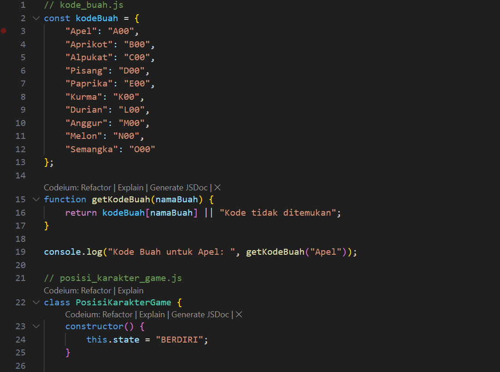
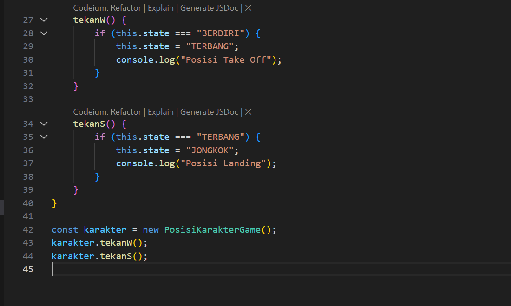
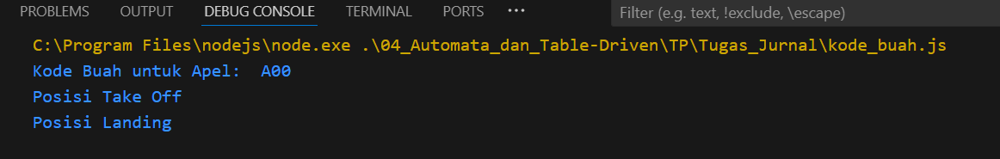

# Namirah Salsabila / 2211104087

**penjelasan code**
**Kode di atas mengimplementasikan class PosisiKarakterGame dalam Node.js untuk mengelola perubahan posisi karakter berdasarkan input. Class ini menggunakan properti state untuk menyimpan status karakter, seperti "BERDIRI" atau "TERBANG". Method tekanW mengubah status karakter menjadi "TERBANG" jika sebelumnya "BERDIRI", sementara tekanS mengubahnya menjadi "JONGKOK" jika sebelumnya "TERBANG". Pada bagian utama, instance class dibuat dan method dipanggil untuk mensimulasikan perubahan posisi karakter. Pendekatan ini memudahkan pengelolaan state dalam permainan secara terstruktur.**

  
**source code 1**

  
**source code 2**

  
**Output**
