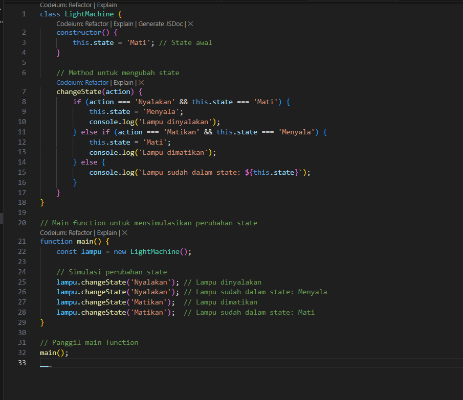
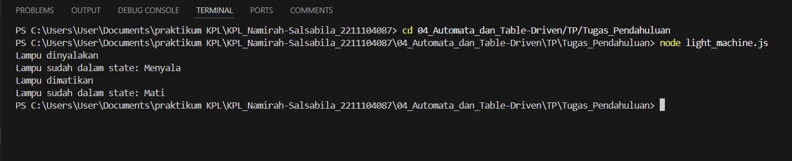
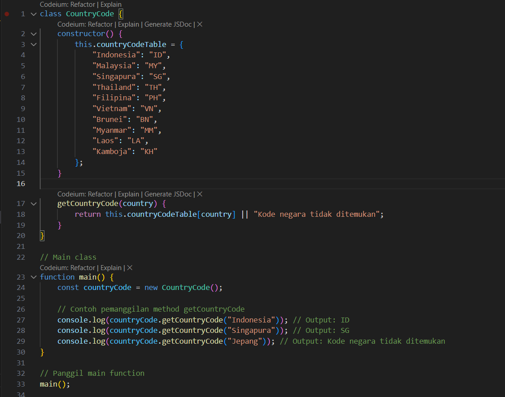
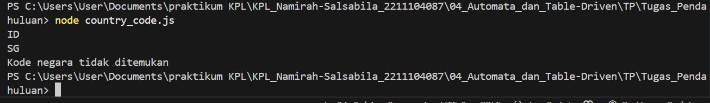

# Namirah Salsabila / 2211104087

**penjelasan code light_machine.js**
**Program light_machine.js adalah simulasi sederhana yang meniru cara kerja sistem pintu menggunakan Finite State Machine dengan dua kondisi utama: "Terkunci" dan "Terbuka". Program ini memungkinkan perubahan status pintu melalui metode changeState(action), yang menerima instruksi seperti "BukaPintu" untuk membuka pintu jika sedang terkunci, serta "KunciPintu" untuk mengunci pintu jika dalam keadaan terbuka. Jika perintah yang diberikan tidak sesuai dengan kondisi saat ini, program akan menampilkan pesan bahwa pintu sudah berada dalam keadaan yang dimaksud.**

  
**source code**

  
**output**

**penjelasan code country_code.js**
**Di sisi lain, country_codes.js berfungsi sebagai alat pencarian kode pos berdasarkan nama kelurahan. Program ini menggunakan objek (kodePosTable) untuk menyimpan daftar kelurahan beserta kode posnya. Metode getKodePos(kelurahan) digunakan untuk mengambil kode pos sesuai dengan nama kelurahan yang dimasukkan. Jika kelurahan tidak ditemukan dalam daftar, maka akan muncul pesan "Kode pos tidak ditemukan"**

  
**Source code**

  
**Output**