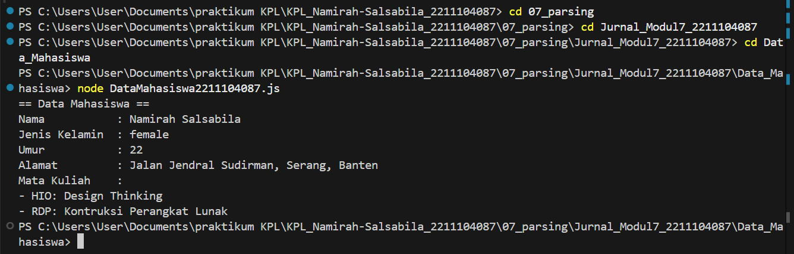
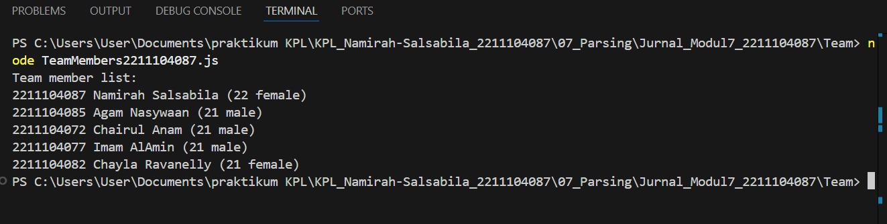
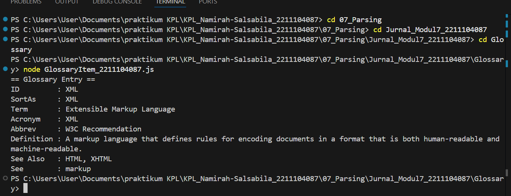

# Namirah Salsabila / 2211104087

**Penjelasan Code**

Program pertama berfungsi untuk membaca sebuah file JSON yang memuat data mahasiswa, lalu menampilkannya ke layar. Di dalam program ini, data seperti nama lengkap, umur, jenis kelamin, alamat, dan daftar mata kuliah diproses dan ditampilkan dalam format yang mudah dibaca. Sementara itu, program kedua dibuat khusus untuk menampilkan data anggota kelompok dari file JSON yang sudah diatur sedemikian rupa, dengan menyajikan informasi seperti NIM, nama lengkap, usia, serta jenis kelamin dari setiap anggota secara runtut dan jelas. Program ketiga memiliki fokus berbeda, yakni mengambil data dari bagian spesifik dalam struktur JSON yang lebih kompleks, tepatnya dari objek "GlossEntry". Di bagian ini, program menampilkan informasi glosarium secara lengkap, termasuk ID, istilah, singkatan, definisi, dan referensi terkait. Ketiga program tersebut menggunakan pendekatan serupa: membaca file yang berada di folder "solution", memproses isinya dengan parsing JSON, lalu menampilkan hasilnya dalam format teks yang informatif dan terstruktur.

**Output Code**

Output DESERIALIZATION 1
 

Output DESERIALIZATION 2
 

Output DESERIALIZATION 3
  
