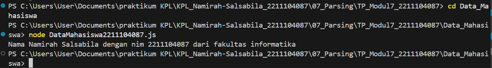
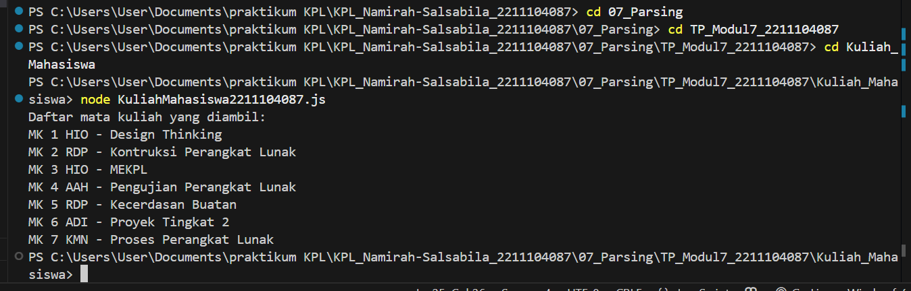

# Namirah Salsabila / 2211104087
**Penjelasan Code**

Dua potongan kode JavaScript ini dibuat untuk membaca dan menampilkan isi file JSON dengan rapi. Kode pertama ada di dalam kelas "DataMahasiswa2211104082", tugasnya membuka file "data.json", lalu mengubah isinya jadi objek pakai "JSON.parse". Setelah itu, program menampilkan info mahasiswa, seperti nama lengkap (hasil gabungan nama depan dan belakang), NIM, dan fakultas asal. Kode kedua ada di kelas "KuliahMahasiswa2211104082", dan dipakai buat membaca file "matkul.json" yang isinya daftar mata kuliah. Lewat method "ReadJSON()", program bakal menampilkan data satu per satu dari MK 1 sampai MK terakhir, lengkap dengan kode dan nama mata kuliah. Keduanya pakai modul "fs" untuk baca file, dan juga sudah dilengkapi dengan error handling biar aman kalau ada masalah saat proses baca atau parsing. Intinya, kedua program ini dibuat supaya data dari file JSON bisa diakses dan ditampilkan dengan gampang.

**Output Code**

Output DESERIALIZATION 1
 

Output DESERIALIZATION 2
 
