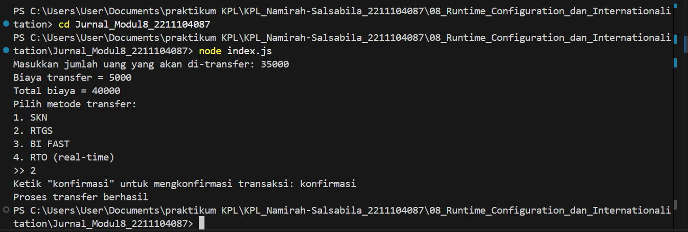

# Namirah Salsabila / 2211104087
**Penjelasan Code**

Program ini adalah aplikasi transfer uang berbasis Node.js yang menggunakan file konfigurasi bank_transfer_config.json. File ini menentukan bahasa, batas transfer, biaya, metode transfer, dan kata konfirmasi. Saat dijalankan, program menyesuaikan tampilan dan alurnya berdasarkan konfigurasi tersebut. Pengguna memasukkan nominal, memilih metode, dan mengonfirmasi transaksi. Hasilnya, transfer berhasil atau dibatalkan. Semua perilaku program dapat diubah hanya dengan mengedit file konfigurasi.

**Output Code**

  
