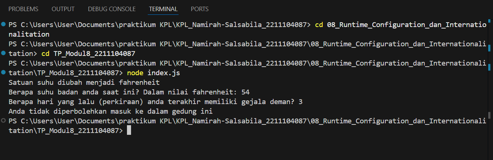

# Namirah Salsabila / 2211104087
**Penjelasan Code**

Program ini ngecek apakah seseorang boleh masuk ke gedung atau nggak berdasarkan suhu badan dan lama demam terakhir. Data aturan dan pesan diambil dari file konfigurasi. Kalau file belum ada, program bakal bikin dengan isi default. User diminta masukin suhu dan hari terakhir demam, lalu hasilnya ditentukan dari situ. Ada juga fitur buat ganti satuan suhu dari celcius ke fahrenheit dan sebaliknya.

**Output Code**

  
