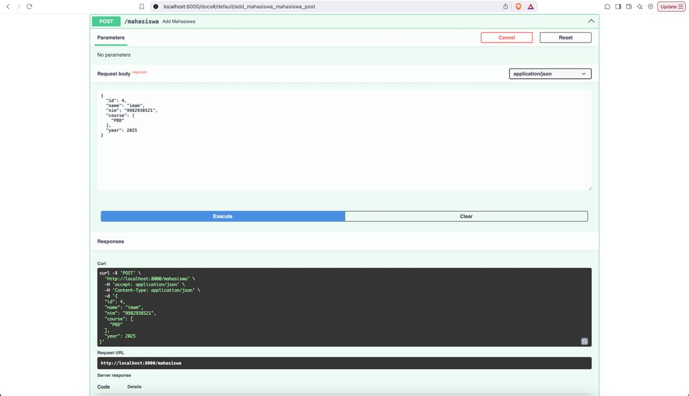
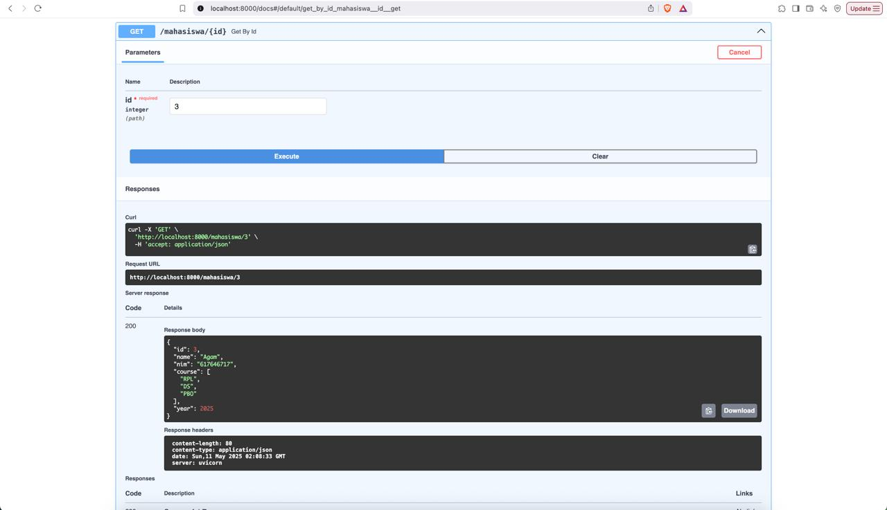
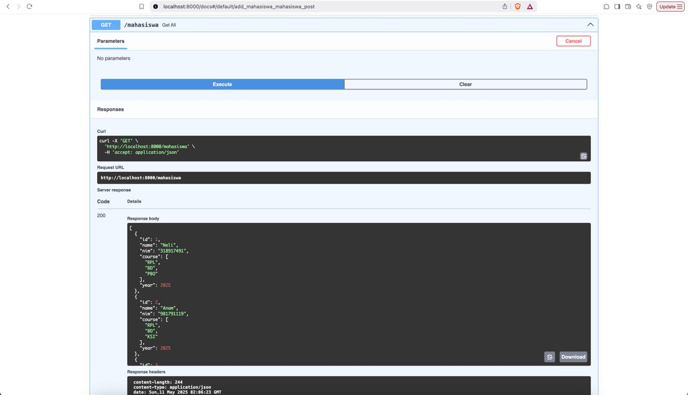
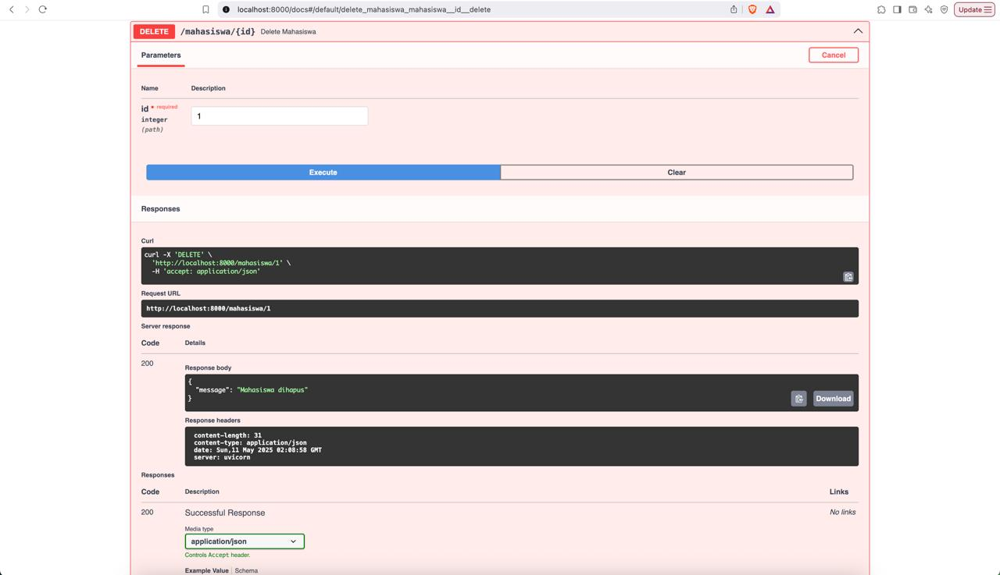

# Namirah Salsabila / 2211104087

**penjelasan cose**

Kode di atas adalah sebuah aplikasi web sederhana menggunakan FastAPI yang menyediakan API untuk mengelola data mahasiswa. Model Mahasiswa didefinisikan dengan atribut seperti id, name, nim, course (list mata kuliah), dan year. Data mahasiswa disimpan dalam list mahasiswa_list. Aplikasi ini memiliki empat endpoint: GET /mahasiswa untuk mengambil semua data, GET /mahasiswa/{id} untuk mengambil mahasiswa berdasarkan ID, POST /mahasiswa untuk menambah data baru, dan DELETE /mahasiswa/{id} untuk menghapus data berdasarkan ID; jika ID tidak ditemukan, maka akan mengembalikan respons error 404.

**output**

  
  
  
  