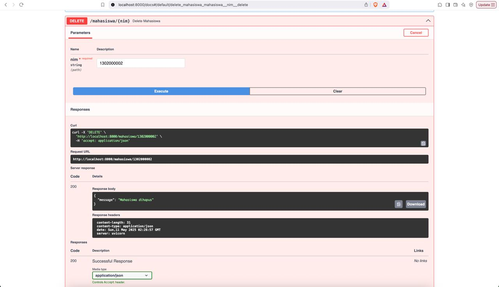
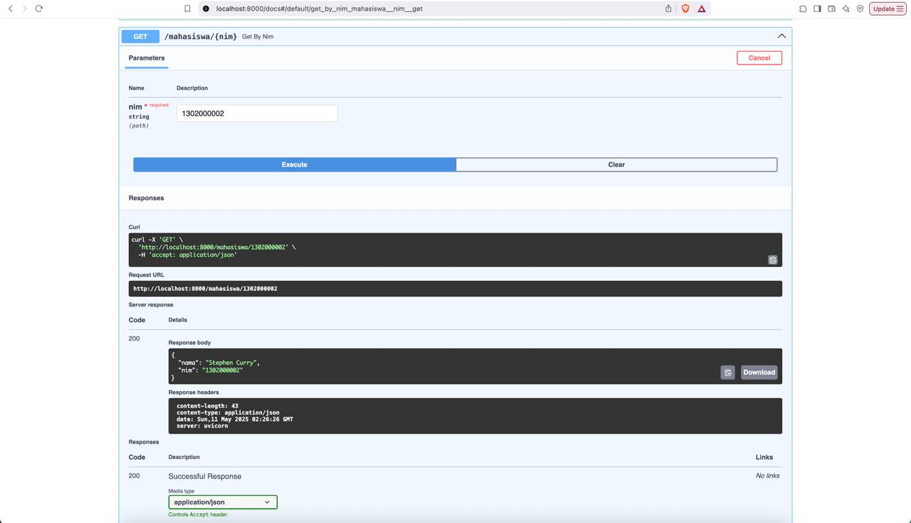
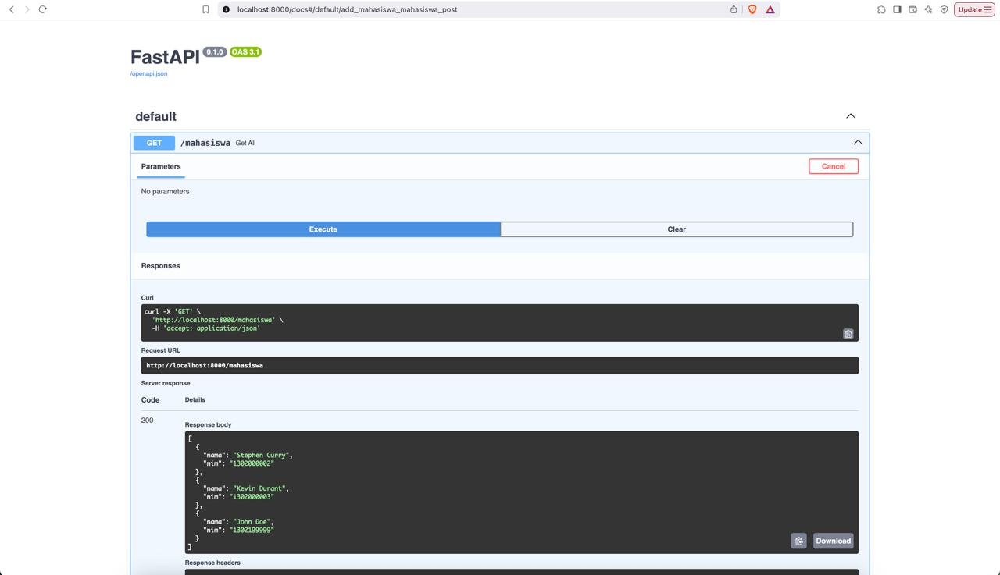
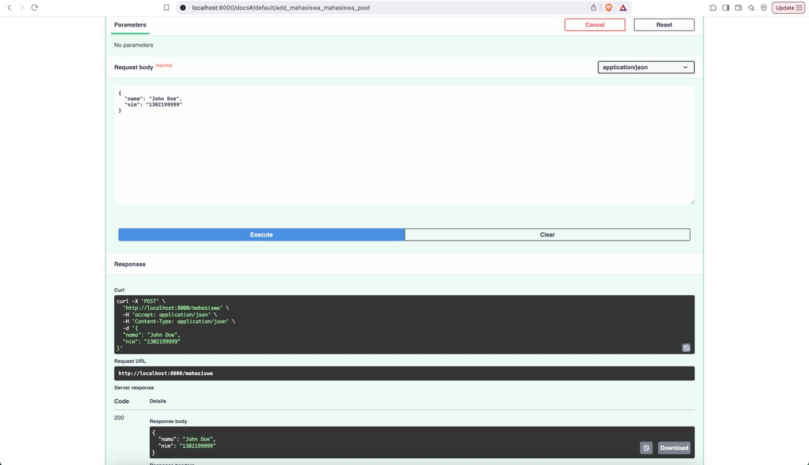
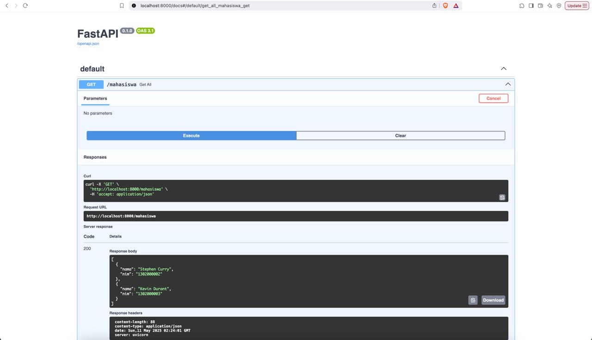

## Namirah Salsabila / 2211104087

**Penjelasan Code**

Kode di atas adalah aplikasi FastAPI yang menyediakan REST API untuk mengelola data mahasiswa berupa nama dan NIM. Data disimpan dalam list mahasiswa_list secara sementara (tanpa database), dan aplikasi menyediakan empat endpoint: GET /mahasiswa untuk mengambil semua data, GET /mahasiswa/{nim} untuk mengambil mahasiswa berdasarkan NIM, POST /mahasiswa untuk menambahkan mahasiswa baru (dengan validasi agar NIM tidak duplikat), serta DELETE /mahasiswa/{nim} untuk menghapus data berdasarkan NIM; jika NIM tidak ditemukan, akan diberikan error 404.

**Output**

  
  
  
  
