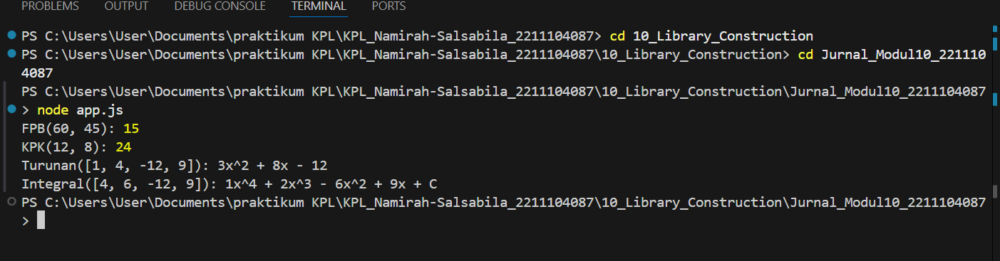

# Namirah Salsabila / 2211104087
**penjelasan code**

Kode di atas terdiri dari dua file: app.js dan MatematikaLibraries.js. File MatematikaLibraries.js berisi kelas MatematikaLibraries yang menyediakan fungsi-fungsi matematika statis, seperti FPB (Faktor Persekutuan Terbesar), KPK (Kelipatan Persekutuan Terkecil), Turunan, dan Integral. FPB dihitung menggunakan algoritma Euclidean, sedangkan KPK memanfaatkan hasil FPB. Fungsi Turunan dan Integral bekerja dengan array koefisien polinomial, di mana Turunan menghitung turunan setiap suku, dan Integral menghitung integral tak tentu dengan menambahkan konstanta "C". File app.js mengimpor modul tersebut dan menampilkan hasil perhitungan untuk contoh-contoh tertentu. Outputnya berupa string yang merepresentasikan hasil operasi matematika dalam bentuk persamaan polinomial.

**output code**

 