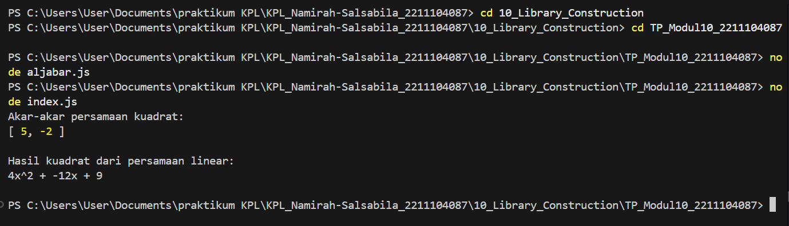

# Namirah Salsabila / 2211104087
**penjelasan code**

Modul ini terdiri dari aljabar.js yang berisi class AljabarLibraries dengan dua fungsi: AkarPersamaanKuadrat untuk mencari akar persamaan kuadrat (ax² + bx + c) menggunakan rumus diskriminan, dan HasilKuadrat untuk mengembangkan (ax + b)² menjadi bentuk kuadrat sempurna. File index.js mengimpor modul tersebut, menghitung akar persamaan x² - 3x - 10 = 0 serta hasil kuadrat dari (2x - 3)², lalu menampilkan outputnya dalam format yang jelas. Kode ini dirancang modular untuk memudahkan penggunaan kembali dalam proyek lain.

**output code**

 