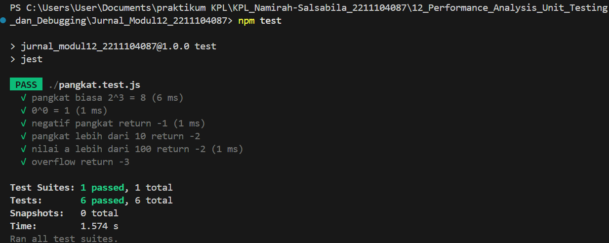
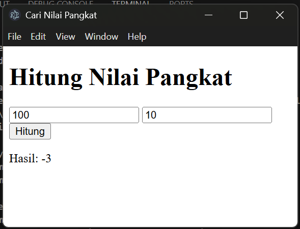
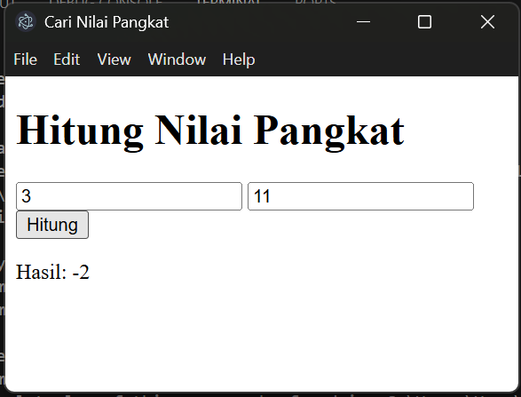
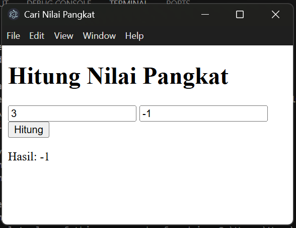
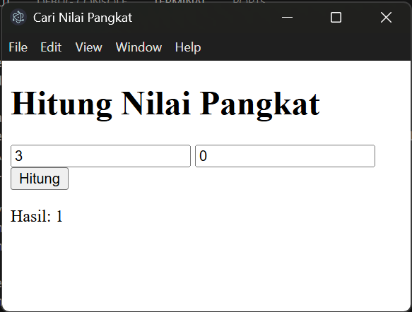

## Namirah Salsabila / 2211104087
**Output**

  
  
  
  

**penjelasan**
Program ini memungkinkan pengguna memasukkan dua bilangan untuk menghitung hasil perpangkatan (a^b) menggunakan metode perulangan. Fungsi CariNilaiPangkat dirancang untuk menangani berbagai kondisi khusus, seperti ketika eksponen (b) bernilai nol, negatif, terlalu besar, atau jika hasil perhitungan melebihi batas yang diperbolehkan. Untuk memastikan keandalan fungsi tersebut, dilakukan pengujian menyeluruh dengan framework Jest yang mencakup semua skenario input yang mungkin. Hasil pengujian menunjukkan bahwa program berhasil mengakomodasi seluruh kasus dengan cakupan logika yang lengkap.