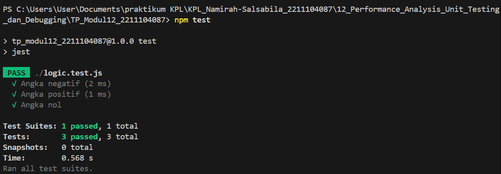
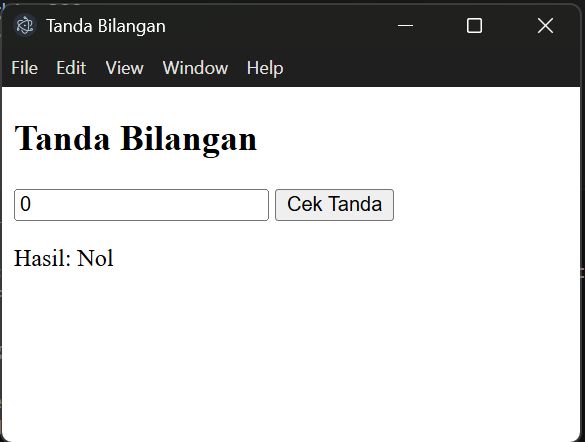
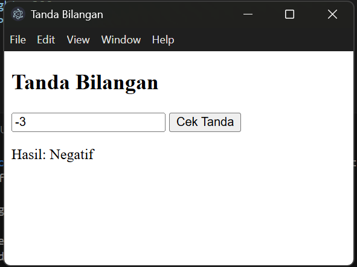
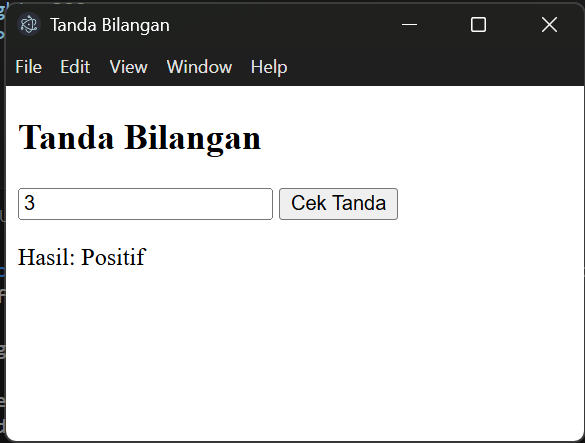

## Namirah Salsabila / 2211104087
**Output**

  
  
  
  

**penjelasan**
Program ini terbagi menjadi dua komponen utama, yaitu antarmuka pengguna berbasis web dan modul pengujian fungsional. Antarmuka dibangun dengan HTML dan JavaScript dasar, menampilkan elemen-elemen sederhana seperti field input angka, tombol proses, dan area hasil. Saat pengguna mengklik tombol, sistem akan membaca nilai input, mengkonversinya ke bilangan integer, kemudian menjalankan fungsi CariTandaBilangan() yang akan menganalisis apakah angka tersebut bernilai negatif, nol, atau positif. Hasil analisis ini kemudian ditampilkan pada area output. Fungsi utama CariTandaBilangan(a) dirancang untuk menerima parameter numerik dan menghasilkan string keterangan status bilangan. Untuk memverifikasi keakuratan fungsi, dilakukan pengujian menyeluruh menggunakan framework Jest yang mencakup tiga kasus uji utama (nilai negatif, nol, dan positif), memastikan semua alur logika dalam fungsi berfungsi sebagaimana mestinya. Hasil pengujian mengkonfirmasi bahwa fungsi tersebut dapat menangani seluruh variasi input dengan tepat.