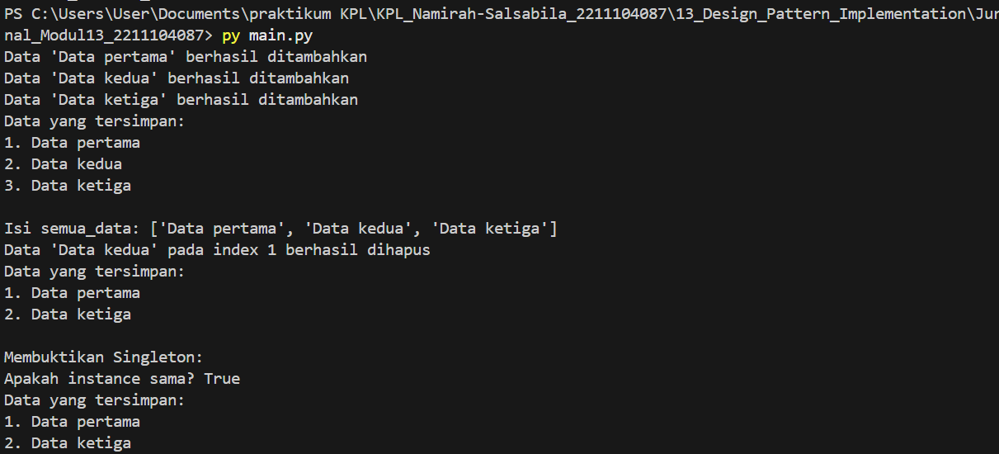

# Namirah Salsabila / 2211104087

## MENJELASKAN SALAH SATU SINGLETON

### A. Contoh kondisi dimana design pattern “Singleton” dapat digunakan
1. Pengaturan koneksi database
Saat aplikasi membutuhkan satu instance tunggal untuk mengelola koneksi ke database, agar tidak terjadi pemborosan sumber daya akibat banyak koneksi yang terbuka sekaligus.
2. Manajemen konfigurasi aplikasi
Saat aplikasi perlu menyimpan konfigurasi global yang harus diakses oleh banyak bagian aplikasi, dan hanya boleh ada satu sumber konfigurasi yang konsisten selama runtime.

### B. Langkah-langkah mengimplementasikan design pattern “Singleton”
1. Membuat konstruktor kelas menjadi private/protected
Agar tidak bisa dibuat instance baru dari luar kelas.
2. Membuat sebuah variabel statis yang menyimpan instance tunggal kelas tersebut
Variabel ini akan menjadi satu-satunya instance yang digunakan selama aplikasi berjalan.
3. Menyediakan method statis (misalnya getInstance()) yang mengembalikan instance tunggal tersebut
Jika instance belum dibuat, maka method ini akan membuatnya terlebih dahulu, jika sudah ada, method hanya mengembalikan instance yang ada.

### C. Tiga kelebihan dan kekurangan dari design pattern “Singleton”
1. Kelebihan:
- Kontrol akses ke instance tunggal
Memastikan hanya ada satu objek yang dibuat sehingga penggunaan sumber daya lebih efisien.
- Mudah diakses secara global
Instance dapat diakses dari mana saja tanpa harus melewatkan objek secara eksplisit.
- Mencegah inkonsistensi data
Karena hanya ada satu instance, maka data yang dikelola menjadi konsisten di seluruh aplikasi.

2. Kekurangan:
- Membatasi fleksibilitas dan pengujian
Singleton sulit untuk diubah atau diuji secara terpisah karena instance global dan state yang menyimpan data.
- Potensi masalah dalam multithreading
Jika tidak diimplementasikan dengan benar, dapat menyebabkan kondisi balapan (race condition) saat beberapa thread mencoba mengakses instance.
- Dapat menyebabkan ketergantungan tersembunyi
Karena mudah diakses global, penggunaan Singleton bisa membuat kode menjadi tightly coupled dan sulit dimodifikasi.

## Output

## Penjelasan Kode
Kode di atas mengimplementasikan design pattern Singleton dalam class PusatDataSingleton untuk memastikan hanya ada satu instance yang dapat digunakan di seluruh program. Class ini memiliki atribut DataTersimpan (list string) untuk menyimpan data dan method seperti AddSebuahData() (menambah data), HapusSebuahData() (menghapus data berdasarkan index), serta PrintSemuaData() (mencetak data). Instance Singleton diakses via GetDataSingleton(), yang membuat instance baru hanya jika belum ada. Contoh penggunaan menunjukkan operasi dasar dan pembuktian bahwa instance benar-benar tunggal. Singleton berguna untuk mengelola sumber daya bersama, seperti penyimpanan data terpusat.

