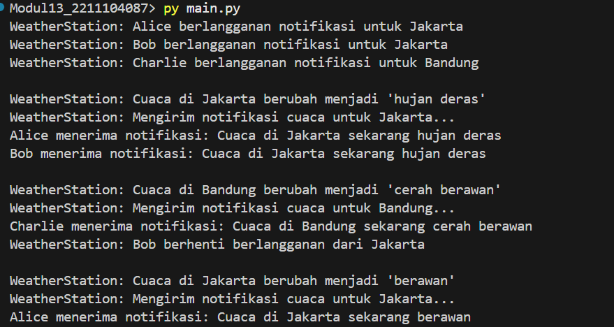

# Namirah Salsabila / 2211104087

## MENJELASKAN SALAH SATU DESIGN PATTERN 

### A. Contoh kondisi di mana design pattern “Observer” dapat digunakan
Design pattern Observer dapat digunakan ketika kita memiliki satu objek (Subject) yang perubahannya perlu diberitahukan ke banyak objek lainnya (Observers), tanpa membuat objek-objek tersebut saling bergantung secara langsung.

Contoh kasus:
Sebuah aplikasi berita memiliki fitur notifikasi. Ketika berita baru diterbitkan (Subject), semua pengguna yang berlangganan (Observers) secara otomatis mendapatkan notifikasi.

### B. Langkah-langkah dalam mengimplementasikan design pattern “Observer”
1. Buat interface Observer
Interface ini mendefinisikan metode update() yang akan dipanggil saat ada perubahan di Subject.

2. Buat interface Subject
Interface ini menyediakan metode untuk menambah, menghapus, dan memberi notifikasi ke observer (attach(), detach(), notify()).

3. Implementasikan kelas Subject konkrit
Kelas ini menyimpan daftar observer dan memanggil metode update() milik observer ketika ada perubahan status.

4. Implementasikan kelas Observer konkrit
Kelas ini mengimplementasikan logika ketika menerima update dari subject.

5. Daftarkan observer ke subject
Observer harus didaftarkan ke Subject agar mendapatkan notifikasi saat perubahan terjadi.

### C. Kelebihan dan kekurangan design pattern “Observer”
1. Kelebihan:

    - Loose coupling (keterikatan longgar): Subject tidak perlu tahu detail dari observer.

    - Mudah ditambahkan observer baru: Tidak perlu mengubah kode Subject.

    - Mendukung komunikasi satu ke banyak: Efektif untuk menginformasikan banyak komponen sekaligus.

2. Kekurangan:

    - Potensi masalah performa: Jika terlalu banyak observer, proses notifikasi bisa memakan waktu.

    - Sulit ditelusuri: Debugging bisa menjadi rumit karena alur eksekusi tidak selalu jelas.

    - Ketergantungan tidak langsung: Meskipun loose coupling, perubahan pada Subject bisa berdampak luas ke banyak Observer.

## IMPLEMENTASI DAN PEMAHAMAN DESIGN PATTERN OBSERVER

## Output

## Penjelasan Kode
Kode tersebut mengimplementasikan pola desain Observer, di mana WeatherStation bertindak sebagai Subject yang memantau dan mengelola data cuaca di berbagai lokasi serta memberi notifikasi perubahan kepada objek-objek Observer yang telah berlangganan pada lokasi tersebut. Kelas Observer adalah antarmuka abstrak untuk pengguna yang ingin menerima update, sedangkan kelas User adalah implementasi konkritnya yang merespons notifikasi cuaca. Pengguna dapat mendaftar (attach) atau berhenti berlangganan (detach) pada lokasi tertentu, dan saat cuaca diperbarui, WeatherStation akan memberitahu semua pengguna terkait melalui metode notify. Dengan demikian, sistem ini memungkinkan pengiriman update cuaca secara dinamis ke pengguna yang relevan berdasarkan lokasi yang mereka pilih