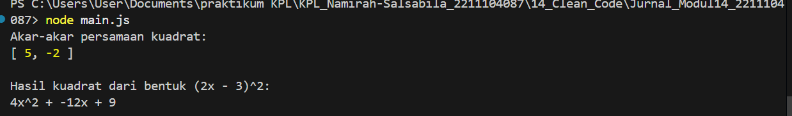

# Namirah Salsabila / 2211104087

**penjelasan cose**

Kode yang telah direfaktorisasi menjadi clean code terbagi dalam dua file utama, yaitu aljabarLibraries.js dan main.js. File aljabarLibraries.js berisi kelas AljabarLibraries dengan dua metode statis, yakni akarPersamaanKuadrat untuk menghitung akar-akar persamaan kuadrat dan hasilKuadrat untuk mengkuadratkan bentuk (ax + b)². Peningkatan kualitas kode dilakukan melalui penerapan camelCase pada penamaan variabel dan fungsi, penambahan komentar penjelas, serta penggunaan const untuk deklarasi nilai tetap guna meningkatkan keamanan dan keterbacaan. Di sisi lain, main.js memanfaatkan kelas tersebut dengan cara yang terstruktur dan menampilkan output secara informatif. Konsistensi dalam whitespace dan indentasi pada kedua file membuat kode lebih mudah dipelihara, dikembangkan, dan dipahami, sehingga mendukung kolaborasi tim dengan lebih baik.

**output**

  
