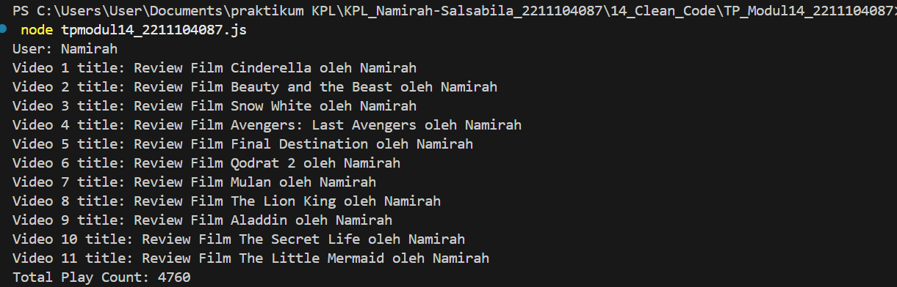

# Namirah Salsabila / 2211104087

**penjelasan code**

 Kode ini mendefinisikan dua kelas utama: SayaTubeVideo dan SayaTubeUser. Kelas SayaTubeVideo merepresentasikan sebuah video dengan properti seperti ID acak 5 digit, judul video, dan jumlah penayangan. Metodenya mencakup increasePlayCount() untuk menambah jumlah penayangan dan printVideoDetails() untuk menampilkan detail video.

Kelas SayaTubeUser merepresentasikan pengguna yang mengunggah video. Pengguna memiliki ID acak, nama pengguna, dan daftar video yang diunggah. Metode addVideo() memastikan hanya objek SayaTubeVideo yang ditambahkan ke daftar. Selain itu, terdapat metode getTotalVideoPlayCount() untuk menghitung total penayangan semua video dan printAllVideoPlayCount() untuk mencetak daftar video beserta judulnya.

Pada fungsi main(), sebuah objek SayaTubeUser dibuat dengan nama "Namirah", lalu 11 video dengan judul berbeda ditambahkan ke akun tersebut. Setiap video diberi jumlah penayangan acak. Program kemudian mencetak daftar video dan total penayangan. Kode ini mensimulasikan sistem sederhana seperti YouTube, di mana pengguna dapat mengunggah video dan melacak statistiknya.

**output**

  