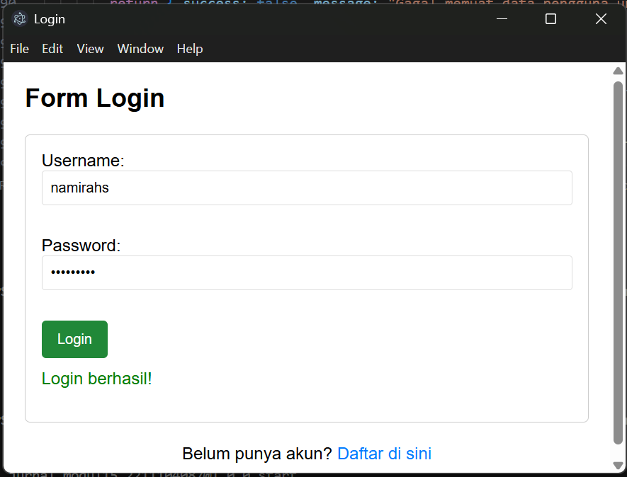

# Namirah Salsabila / 2211104087

**penjelasan cose**

Aplikasi ini merupakan program desktop berbasis JavaScript dan Electron yang menyediakan fitur registrasi dan login pengguna. Terdapat tiga halaman utama dalam aplikasi ini: login, registrasi, dan dashboard. Saat pertama kali dijalankan, pengguna akan disambut oleh form login. Jika belum memiliki akun, pengguna dapat berpindah ke halaman registrasi melalui tautan yang tersedia. Di halaman registrasi, pengguna diwajibkan mengisi username dan password sesuai dengan aturan yang ketat. Username harus terdiri dari 8 hingga 20 karakter dan hanya boleh menggunakan huruf dan angka. Password harus memiliki panjang minimal 8 karakter, mengandung huruf kapital, angka, serta karakter spesial seperti !@#$, dan tidak boleh memuat username di dalamnya. Jika input tidak sesuai, sistem akan langsung menolaknya dan memberikan pesan kesalahan yang jelas.

Keamanan menjadi prioritas utama dalam aplikasi ini. Password tidak pernah disimpan dalam bentuk asli, melainkan diubah terlebih dahulu menggunakan algoritma hashing SHA-256 yang dikombinasikan dengan salt acak. Dengan cara ini, meskipun data pengguna terbaca oleh pihak tidak berwenang, mereka tetap tidak dapat mengetahui password sebenarnya. Semua data pengguna disimpan dalam file JSON terpisah bernama users.json. Saat proses login, sistem akan mencari username yang sesuai dan memverifikasi password dengan mencocokkan hasil hash-nya. Jika data cocok, pengguna akan diarahkan ke halaman dashboard yang menampilkan informasi akun mereka. Dari dashboard, pengguna bisa memilih untuk logout dan kembali ke halaman login. Aplikasi ini dibangun dengan prinsip secure coding, memastikan seluruh input tervalidasi secara menyeluruh dan setiap kesalahan ditangani dengan baik tanpa menyebabkan aplikasi mengalami crash.

**output**

